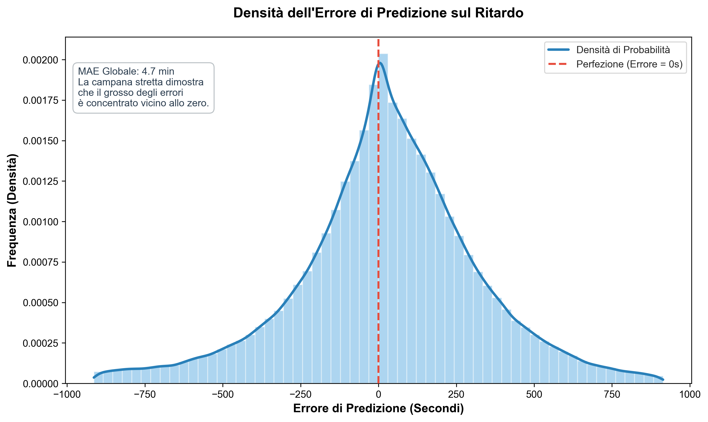
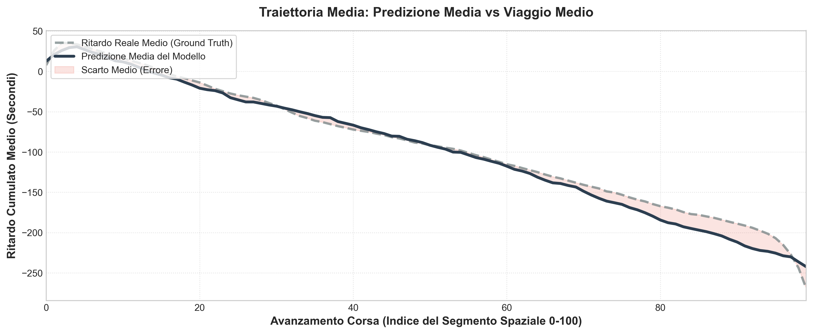
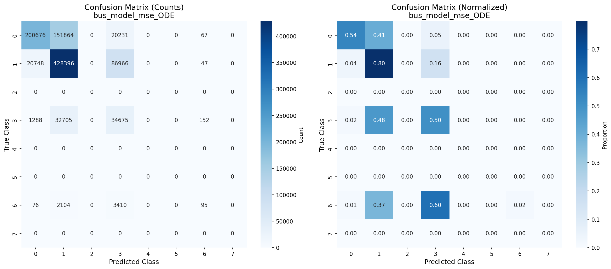

# ATAC Bus Delay & Occupancy Prediction

A deep-learning system that forecasts **per-stop delay** and **crowd level** for every scheduled trip on Rome's ATAC bus network, fusing GTFS real-time feeds, live traffic, and weather into a single predictive view of the city's transit.

This repository began as a thesis project and continues to grow as a personal research effort.

> **Note:** the codebase is currently undergoing a deep refactor. Module boundaries, interfaces, and some architectural choices are subject to change. This README will be updated to reflect the new structure as the refactor progresses.

---

## Vision

Public transit in a city the size of Rome is a chaotic system: schedules drift, traffic shifts minute to minute, weather reshapes demand, and riders are left guessing. The goal of this project is to turn that chaos into a **trustworthy, per-stop forecast** that a commuter could actually plan around — not a vague ETA, but a principled prediction with a clear sense of its own uncertainty.

The long-term ambition is a system robust enough to sit behind a production service. The current stage is the research scaffolding that makes such a service possible: a real-time data collector, a dual-model prediction pipeline, and the tooling to validate it against reality.

## What it does

- **Ingests** GTFS-RT vehicle positions, TomTom traffic tiles, and Open-Meteo weather, projecting everything onto a shared H3 hexagonal grid.
- **Represents** every trip as a canonical sequence of spatial segments, so predictions from different routes live in the same feature space.
- **Predicts** two quantities per trip with twin neural networks:
  - a **delay regressor** built on a Neural ODE + LSTM decoder,
  - an **occupancy classifier** sharing the same encoder topology.
- **Validates** predictions live against the diaries produced by the collector, streaming error metrics over WebSocket as trips unfold.
- **Visualises** the running state of the system — live vehicles, traffic, weather overlays — in an interactive debug board.

## Performance snapshot

A glimpse of what the current delay model achieves on held-out data. Charts are auto-generated and live in `backend/results/`.

| | |
|---|---|
| **Error distribution** — a tight bell around zero, global MAE ~4.7 min |  |
| **Mean trajectory** — predicted cumulative delay vs. ground truth along a trip |  |
| **Occupancy classifier** — confusion matrix on the 7-class crowd label |  |

## Repository layout

The repo is organised around two cooperating components:

- **`backend/`** — the heart of the project. Hosts the real-time collector, the training pipeline, the FastAPI prediction server, the debug GUI, and all persistence logic.
- **`frontend-thesis/`** — a CLI that talks to the backend for interactive predictions and retrospective or live validation against a given day.

Additional top-level documents (`ARCHITECTURE.md`, `PERFORMANCE.md`, `REPORT.md`, `RESPONSABILITIES.md`) provide deeper context on specific facets of the system. They are being rewritten alongside the refactor and should be read as historical context until that work lands.

## Status & roadmap

This is an active, single-author project. The current focus is a structural refactor aimed at clearer module boundaries, lighter coupling between the collector and the prediction path, and a cleaner separation between research and serving concerns. Once the dust settles, the priorities are:

- tightening the occupancy model (underused classes are visible in the confusion matrix above),
- expanding validation tooling so every model change is measurable,
- and hardening the serving stack toward something closer to a production deployment.

## License

A license has not been selected yet. Until one is chosen, all rights are reserved by the author.
